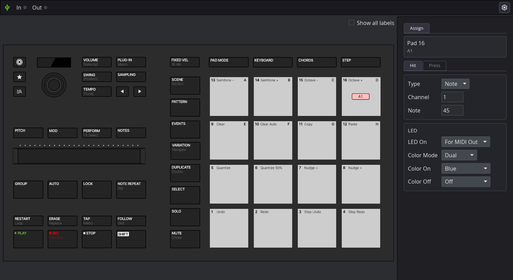

# Maschine Mikro MK3 Linux Driver

Native Instruments Maschine Mikro MK3 userspace MIDI driver for Linux.

No Native Instruments software required. The project has three parts:

- **Driver** — talks to the controller over HID and exposes it as virtual MIDI input and
  output ports. Works with any MIDI software.
- **Configuration GUI** — a desktop app for assigning controls and tuning the hardware.
- **Bitwig controller script** — optional DAW integration built on top of the driver's
  MIDI (modes, step sequencer, transport, clip launcher, and so on).

The driver and GUI are useful on their own; the Bitwig script is only needed for Bitwig
integration.

Inspired by [maschine.rs](https://github.com/wrl/maschine.rs).



*The configuration GUI: click any control on the device diagram (or touch it on the
hardware) and edit how it behaves. No config files to hand-write.*

## Getting Started

Install the build dependencies first:

- Debian/Ubuntu:
  ```
  sudo apt install build-essential pkg-config libasound2-dev libjack-dev libusb-1.0-0-dev libudev-dev
  ```
- Fedora/RHEL:
  ```
  sudo dnf install @development-tools alsa-lib-devel jack-audio-connection-kit-devel libusb-devel systemd-devel
  ```
- Arch Linux:
  ```
  sudo pacman -S base-devel alsa-lib pipewire-jack libusb systemd-libs  # (or `jack2` instead of `pipewire-jack`)
  ```

Then clone the repo, install the udev rule, and start the driver:

```shell
git clone https://github.com/r00tman/maschine-mikro-mk3-driver.git; cd maschine-mikro-mk3-driver
sudo cp 98-maschine.rules /etc/udev/rules.d/
sudo udevadm control --reload && sudo udevadm trigger
cargo run -p driver --release
```

This starts the driver and exposes virtual MIDI input and output ports for the
controller. The driver keeps running when the controller is unplugged and
reconnects automatically when it returns.

To configure the controller, launch the GUI:

```shell
cargo run -p gui
```

The GUI connects to an already-running driver, or starts one for you if none is
running — so you can run the driver headless and only open the GUI when you want to
change something.

Pads have been tested with Hydrogen, EZdrummer 2/3, and Addictive Drums 2 — as
plugins via REAPER + LinVst and standalone via Wine.

> **Note:** Older versions of `98-maschine.rules` only granted access to users in the
> `input` group. The current rule lets any user access the controller, which
> simplifies setup (for example, Ubuntu has no `input` group by default).

## Configuration

Everything is configured from the GUI. Changes apply to the running driver
immediately and are saved automatically — there are no config files to edit by hand.

**Assigning controls.** Click a pad, button, encoder, or slider on the device
diagram — or simply touch it on the hardware — to select it. The **Assign** panel
then lets you set, per control:

- **Type** — Note, CC, or Off (Off disables the control so it sends nothing).
- **Channel** — the MIDI channel for that control.
- **Note / CC number** — the value it sends.
- **Hit / Press** — pads expose separate actions for the initial hit (with velocity)
  and for continued pressure (polyphonic aftertouch).

**Per-pad LED colours.** Each pad has its own idle and active colour, with a choice of
colour source (for example, follow the DAW's MIDI output) and an optional cold-to-warm
gradient that reflects how hard the pad is hit.

**Device preferences.** The settings (gear) panel exposes hardware-side options with a
live preview on the controller:

- **Pad sensitivity** and **pad velocity curve** (how hard hits map to MIDI velocity).
- **Display contrast.**
- **Button backlight brightness** — keep the buttons faintly lit even when they would
  otherwise be off.

### Advanced: file-based overrides

Power users can still drive the same settings from a TOML file. Defaults live in code;
your file only contains the keys you override. See `default_config.toml` (regenerate
with `cargo run --bin gen-default-config`) for every available key, then point the
driver at your file:

```shell
cargo run -p driver --release -- -c your_config.toml
```

### Build-time MIDI backend (ALSA or JACK)

By default the driver builds against ALSA via `midir`. For the JACK backend instead, use:

```shell
cargo run -p driver --release --features jack
```

`midir` selects its backend at compile time (no features = ALSA, `["jack"]` = JACK), and
because of Rust [feature unification](https://github.com/rust-lang/cargo/issues/10489) a
single binary cannot offer both.

## Soft-Off

Press `Shift + Maschine` to toggle soft-off. While soft-off is active, the driver
blanks the controller lights and screen and suppresses both outgoing control events and
incoming MIDI feedback until you press the combo again to wake it.

## What Works

Basically everything — and more than the official driver exposes. For example, unpressed
pad LEDs can be turned completely off, and every button has four brightness levels rather
than just Off/On.

**Driver and GUI** — works with any MIDI software:

- Pads (MIDI notes, velocity curves, polyphonic aftertouch)
- All 41 buttons (MIDI CC, including encoder press and encoder touch)
- Encoder (MIDI CC: relative, relative-offset, and absolute modes, reversible)
- Slider / touch strip (MIDI CC, plus optional touch-on/off events)
- All LEDs, including per-pad idle/active colours (driven from your DAW via the virtual MIDI input)
- Screen text via a SysEx protocol on the virtual MIDI input
- Soft-off, hot-plug recovery, and live configuration updates
- Desktop configuration GUI (visual control assignment, per-pad colours, live device preferences)

**Bitwig controller script** — DAW integration layered on top of the driver's MIDI:

- Mode system (Play, Step, Clip, Mixer)
- Note repeat and fixed velocity
- Step sequencer, clip launcher, and mixer controls
- Contextual OLED screen content (mode, track, and note names)
- Pad playback feedback

## Default MIDI Map

These are the factory defaults. You can change any of them in the GUI; they are listed
here only as a reference for what the controller sends out of the box.

**Pads** send Note On/Off. By default they run chromatically from note 36 at pad 1
(bottom-left) up to note 51 at pad 16 (top-right) — left to right, bottom row to top row.
This matches the usual drum-rack layout (pad 1 = C1 = 36).

**Encoder** sends relative values (65+ clockwise, <64 counter-clockwise) on CC 1 by default.

**Slider / touch strip** sends absolute position (0–127) on CC 9 by default.

**Buttons** send CC 127 on press and 0 on release:

| Button | CC | Button | CC | Button | CC |
|--------|----:|--------|----:|--------|----:|
| Maschine | 20 | Swing | 24 | Left | 28 |
| Star | 21 | Tempo | 25 | Right | 29 |
| Browse | 22 | Plugin | 26 | Pitch | 30 |
| Volume | 23 | Sampling | 27 | Mod | 31 |
| Perform | 32 | Lock | 36 | Tap | 40 |
| Notes | 33 | Note Repeat | 37 | Follow | 41 |
| Group | 34 | Restart | 38 | Play | 42 |
| Auto | 35 | Erase | 39 | Rec | 43 |
| Stop | 44 | Keyboard | 48 | Pattern | 52 |
| Shift | 45 | Chords | 49 | Events | 53 |
| Fixed Vel | 46 | Step | 50 | Variation | 54 |
| Pad Mode | 47 | Scene | 51 | Duplicate | 55 |
| Select | 56 | Encoder Press | 59 | | |
| Solo | 57 | Encoder Touch | 60 | | |
| Mute | 58 | | | | |

## Controlling LEDs via MIDI Input

LEDs can be driven from your DAW through the driver's virtual MIDI input.

### Pad LEDs (Note On/Off)

Each pad's LED has a **source**, set per pad in the GUI:

- **MIDI Out** (default) — the LED reflects the pad's own hits.
- **MIDI In** — the LED is driven by incoming MIDI from your DAW.
- **Off** — the LED stays dark.

A pad only responds to DAW MIDI when its source is **MIDI In**, so the incoming and
outgoing paths never fight over the same LED. With that set, send Note On/Off to the pad's
configured note; Note Off (or velocity 0) turns it off.

How the colour is chosen depends on the pad's **colour mode**:

- **Single** — one fixed colour (brighter while held).
- **Dual** — one colour while held, another while idle.
- **Velocity** (default for the MIDI In source) — the velocity selects a fixed colour, so
  your DAW can request a specific colour per note:

| Velocity | Color | Velocity | Color |
|----------|-------|----------|-------|
| 0 | Off | 64-70 | Turquoise |
| 1-7 | Red | 71-77 | Blue |
| 8-14 | Orange | 78-84 | Plum |
| 15-21 | Light Orange | 85-91 | Violet |
| 22-28 | Warm Yellow | 92-98 | Purple |
| 29-35 | Yellow | 99-105 | Magenta |
| 36-42 | Lime | 106-112 | Fuchsia |
| 43-49 | Green | 113-127 | White |
| 50-56 | Mint | | |
| 57-63 | Cyan | | |

> **MIDI In vs MIDI Out velocity.** The table above applies to the **MIDI In** source,
> where velocity is a colour selector. The **MIDI Out** source instead reads velocity as
> hit strength and maps it along a cool-to-warm gradient (Violet when soft → Red when hard),
> so harder hits glow warmer. The two interpretations are independent.

### Button LEDs (CC)

Send CC to a button's configured CC number to set its brightness:

- 0: Off (or the configured backlight level when button backlight is enabled)
- 1-42: Dim
- 43-84: Normal
- 85-127: Bright

## Bitwig Studio Integration

A controller script provides full Bitwig integration — the mode system (Play, Step, Clip,
Mixer), step sequencer, clip launcher, mixer controls, transport, and pad playback feedback,
all layered on top of the driver's MIDI.

Setup and the complete control reference live in **[docs/bitwig.md](docs/bitwig.md)**.

## Goal

This project provides a complete MIDI implementation for the Maschine Mikro MK3 on Linux,
including:

- Full hardware support (pads, buttons, encoder, slider, LEDs, screen)
- A desktop configuration GUI for assigning controls and tuning the hardware
- Advanced DAW integration with Bitwig Studio
- Performance features like Note Repeat and Fixed Velocity
- Multiple operational modes (Play, Step Sequencer, Clip Launcher, Mixer)

The driver works at the HID level without requiring Native Instruments' proprietary
software, making it a truly open-source alternative that works natively on Linux.

Contributions are welcome!

## Trademarks

MASCHINE, Native Instruments, and NI are trademarks of Native Instruments GmbH.
This project is an independent, unofficial driver and is not affiliated with,
sponsored by, or endorsed by Native Instruments. Product and company names are
used only to identify the hardware this driver targets.

## Third-party assets

The toolbar icons (USB and settings) and the control icons in the device diagram
are from [Google Material Symbols](https://fonts.google.com/icons), licensed under
the [Apache License 2.0](https://www.apache.org/licenses/LICENSE-2.0).
